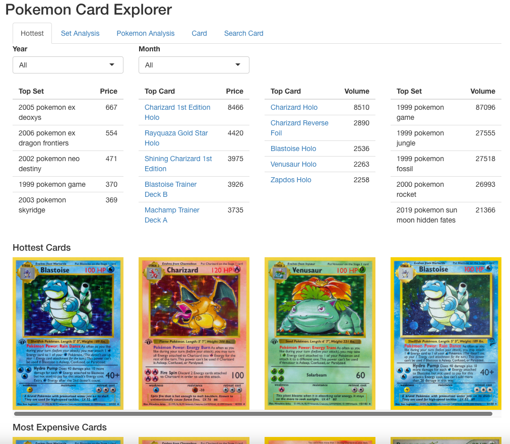
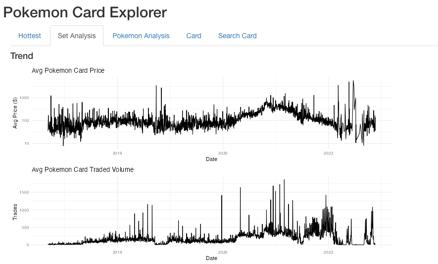
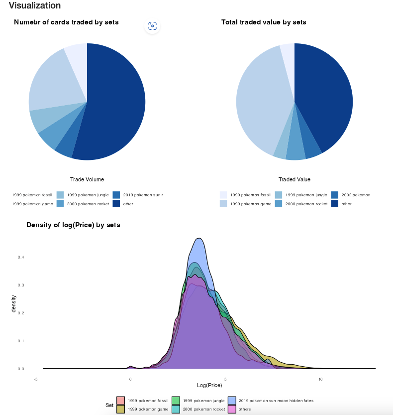
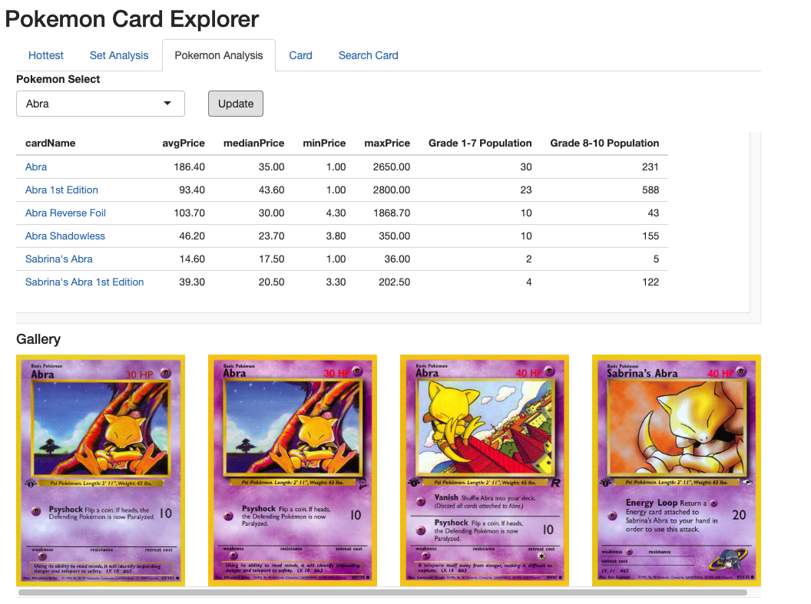
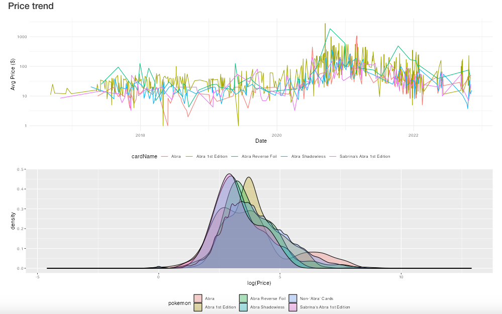
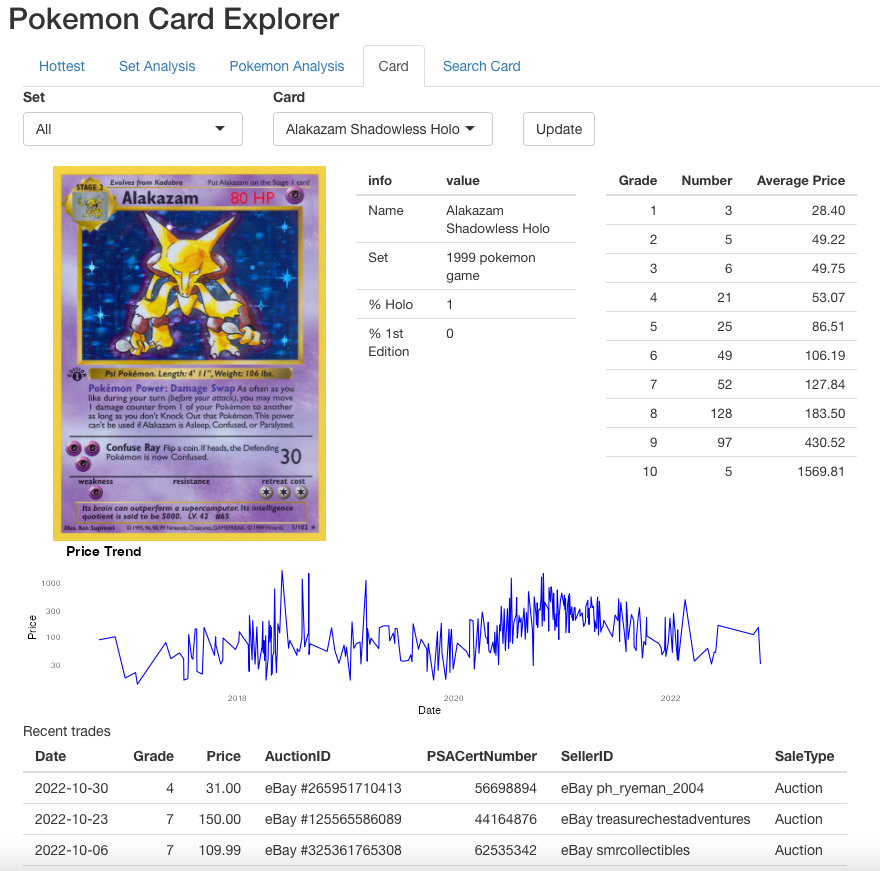
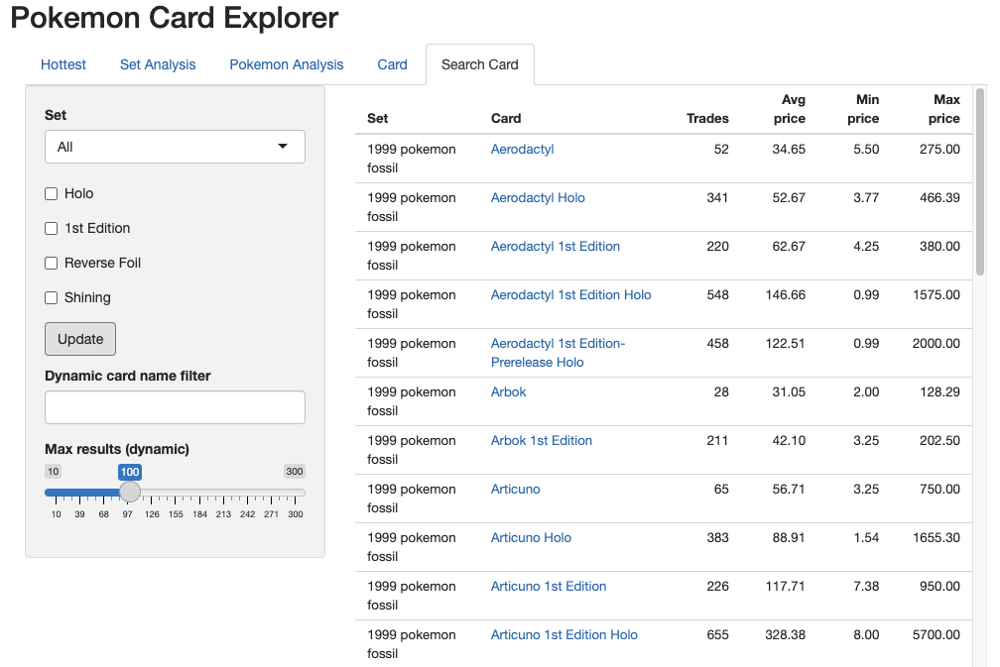

# Pokemon-Card-Explorer

`webscrape.R`: Scrape Pokemon Card trades from PokePrice.com, save to `./data/pokemon.sqlite`

`shinyapp.R`: Shiny dashboard to explroe the trades data set. Consist of 5 tabs: "Hottest", "Set Analysis", "Pokemon Analysis", "Card", "Search Card".
Click on any Pokemon card names throughout the app to jump to "Card" page and view its detailed information.

UI:
{width=70%, height=70%}
{width=70%, height=70%}
{width=70%, height=70%}
{width=70%, height=70%}
{width=70%, height=70%}
{width=70%, height=70%}
{width=70%, height=70%}
